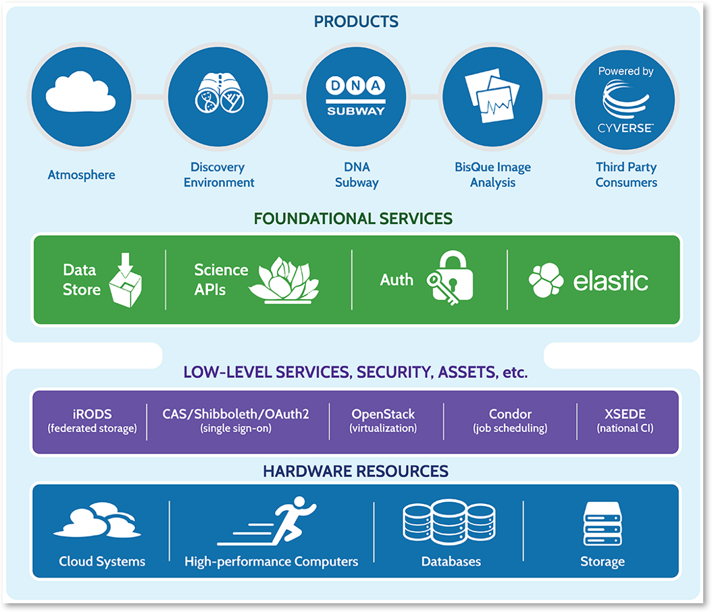

.. include:: cyverse_rst_defined_substitutions.txt

|CyVerse logo|

Data Management and Software Reproducibility Workshops
---------------------------------------------------------

Working with “Big data” is challenging for most researchers. These workshops
introduce free  open-source approaches that reduce these challenges and deliver
research that is more impactful, open, and reproducible. Technologies covered
feature solutions developed by publicly funded cyberinfrastructure developed in
the US (CyVerse - www.cyverse.org) and Europe (CyVerse UK, ELIXIR, and others).

----

Upcoming Workshops
~~~~~~~~~~~~~~~~~~~~~

  .. admonition:: Workshop Location

    **Rome, Italy - October 2019**

    **Host** University of Arkansas

    **Location**: University of Arkansas Rome Center: Palazzo Taverna, Via di Monte Giordano,
    36 - 00186 Rome Italy.

    **Dates**:

    Each workshop will run from afternoon to afternoon (see *Draft Agenda* below for times)

    - *Data Management*: October 2nd - October 3rd
    - *Software Reproducibility*: October 3rd - October 4th

    **Costs/Funding/Registration**:

    A fee of $40 US for each workshop ($80 US total if attending both) covers the
    use of the facility. Participants are responsible for all costs associated with
    their attendance (travel, lodging, meals, etc.).  The workshop fee will cover
    facility setup and administrative costs, as well as AM and PM refreshment breaks.
    There will be an optional luncheon between the workshops on Thursday October
    4 at a cost of $20 US.

    **Workshop Registration**

    .. raw:: html

     <div id="eventbrite-widget-container-64003008722"></div>
     <script src="eb_widgets.js"></script>

     <script type="text/javascript">
         var exampleCallback = function() {
             console.log('Order complete!');
         };

         window.EBWidgets.createWidget({
             // Required
             widgetType: 'checkout',
             eventId: '64003008722',
             iframeContainerId: 'eventbrite-widget-container-64003008722',

             // Optional
             iframeContainerHeight: 425,  // Widget height in pixels. Defaults to a minimum of 425px if not provided
             onOrderComplete: exampleCallback  // Method called when an order has successfully completed
         });
     </script>
     </div>

----


Workshop Audiences, Learning Outcomes, and Prerequisites
```````````````````````````````````````````````````````````

Data Management Workshop
#########################

**Audience**
Investigators and researchers working in all areas of the life sciences.
Workshop delivery style will benefit those looking for information on and making
decisions about these technologies (e.g. principal investigators, grant writers,
funders/grant officers, etc.) but who may not actually use them day-to-day.

**Learning Outcomes**

At this workshop learners will:

- Be able to identify common challenges for large biological datasets
- Understand the value of  FAIR and other open science principles
- Understand how to apply free technologies for data sharing, metadata
  annotation, and repository hosting to their own use cases
- Be able to critique data management plans and create (or refine) a custom plan
  that benefits their lab and their research

**Prerequisites**:
This workshop is suitable for a non-technical audience.
For computer labs, basic knowledge in working with spreadsheets (e.g. Excel)
is helpful. Attendees must bring their own Wi-Fi enabled laptop.


*Software Reproducibility Workshop*
######################################

**Audience**
Investigators and researchers working in all areas of the life sciences.
Workshop delivery style will benefit those looking for information on improving
how they use software in their research - from simple scripts developed in-house
to building robust, reproducible, and scalable, pipelines.

**Learning Outcomes**
At this workshop learners will:

- Be able to identify common reproducibility challenges for commonly used
  software
- Follow a series of case studies that introduce reproducibility technologies
  like version control (e.g. git, GitHub) and containerization (Docker)
- Be able to deploy reproducible applications using Binder and CyVerse
- Understand (and be able to create) a software management plan that benefits
  their lab and their research

 **Prerequisites**
 This workshop will have several labs involving use of the
 command line (Linux/Unix). Some basic command line experience is strongly
 suggested. Attendees must bring their own Wi-Fi enabled laptop.

-----


Agendas
~~~~~~~~~~~~~~~~~~~~~

**Draft Agenda (subject to change)**

*Data Management*: October 2nd - October 3rd

**October 2nd**

.. list-table::
  :header-rows: 1

  * - Time
    - Topic
    - Objectives and Activities
  * - 14:00
    - Workshop overview and introduction to CyVerse - Technology for open
      science (*lecture*)
    - Brief overview of `CyVerse <http://www.cyverse.org>`_
      (publicly funded infrastructure project)
      and learn how it is being adopted internationality (CyVerse UK,
      CyVerse Austria, CyVerse Australia ), how they can make free
      use of it, and how these and other technologies are relevant to European
      bioinformatics and infrastructure projects (e.g. `ELIXIR <https://elixir-europe.org/>`_ and `EOSC <https://ec.europa.eu/research/openscience/index.cfm?pg=open-science-cloud>`_).
      We will also introduce common tools and related vocabulary for
      computing in life science research.
  * - 14:30
    - FAIR in practice - Increasing the impact of your work through Open Science
      (*lecture and interactive discussion*)
    - Participants will get an introduction to the `FAIR principles <https://www.go-fair.org/fair-principles/>`_ and an
      overview of some of the major community projects and technological
      approaches for implementing FAIR and complying with mandates such as
      `Plan S <https://www.coalition-s.org/>`_. Key ideas and approaches to
      Open Science will be introduced. An interactive discussion on data
      management challenges will have participants work through sections of
      grant applications (their own and provided examples) to identify weak
      points in FAIRness.
  * - 15:30
    - Break
    -
  * - 15:45
    - Making data reusable and interoperable with metadata standards (*lecture*)
    - Participants will learn how community and repository standards can be
      selected and implemented for their own datasets.
  * - 16:15
    - Managing data with Open Refine (*lab*)
    - Using the open-source `Open Refine <http://openrefine.org/>`_ software,
      participants will explore how metadata can be organized and validated to
      comply with their choice of metadata standards.
  * - 18:00
    - End of Day One
    -

**October 3rd**

.. list-table::
  :header-rows: 1

  * - Time
    - Topic
    - Objectives and Activities
  * - 8:30
    - Associating data with Metadata (*lab*)
    - Users will be guided through associating metadata with Data on the CyVerse
      platform using its graphical interface to `iRODS <https://irods.org/>`_
      (a data storage technology used by several international repositories)
  * - 9:00
    - Making data available through repositories (*lecture*)
    - We will introduce popular repositories and the typical
      requirements for publication of datasets including choices of licensing.
  * - 9:30
    - CyVerse Data Commons publication model (*lab*)
    - Participants will be guided through making data available and citable
      (DOI issuing) on the CyVerse data store. We will also demonstrate
      publication directly from CyVerse to NCBI and also ENA using `COPO <https://copo-project.org/>`_.
  * - 10:00
    - Increasing the value of your work with pre-prints and getting credit with
      data licensing (*lecture*)
    - We will discuss the evidence and some available solutions for making use
      of pre-prints and solutions for choosing a data license.
  * - 10:30
    - Break
    -
  * - 10:45
    - Making a data management plan work for you (*lab and interactive discussion*)
    - Participants will start to summarize lessons learned by completing a
      Data Stewardship wizard and generating an updated data management plan
  * - 11:30
    - Summary and Road mapping (*lab and interactive discussion*)
    - Participants will work in small teams to develop learning roadmaps to be
      implemented post-workshop (What will they change? what questions do they
      still have? what technologies would the like more information on? etc.).
      These will be shared and collected and the instructional team will leave
      additional feedback and suggestions on the maps during and shortly after
      the workshop.
  * - 13:00
    - Finish (End of Workshop)
    - Lunch available (purchase ticket at Eventbrite link)

----

**13:00 October 3rd - Lunch will be available at the Workshop Venue**: Eventbrite ticket purchase required.

----

*Software Reproducibility*: October 3rd - October 4th

**October 3rd**

.. list-table::
  :header-rows: 1

  * - Time
    - Topic
    - Objectives and Activities
  * - 14:00
    - Workshop overview and Introduction to CyVerse - Technology for Open Science (*lecture*)
    - Brief overview of `CyVerse`_
      (publicly funded infrastructure project)
      and learn how it is being adopted internationality (CyVerse UK,
      CyVerse Austria, CyVerse Australia ), how they can make free
      use of it, and how these and other technologies are relevant to European
      bioinformatics and infrastructure projects (e.g. `ELIXIR`_ and `EOSC`_).
      We will also introduce common tools and related vocabulary for
      computing in life science research.
  * - 14:30
    - 4OSS - Introduction to Open Source Software Principles (*lecture*)
    - Participants will have learn about the `4OSS principles <https://softdev4research.github.io/recommendations/>`_
      and how they support reproducible, high-impact science through sustainable
      software and computing choices.
  * - 15:00
    - Github for software management and reproducibility - a brief introduction
      to Github (*lab*)
    - Participants will get an brief introduction to repository creation in `Github <https://github.com/>`_
      and learn the value of developing code that is open from day one. Will
      introduce choices for licensing and recommendations for fostering and
      managing contributions.
  * - 15:30
    - Break
    -
  * - 15:45
    - Github Lab - Continued
    -
  * - 16:45
    - Containers for Computing (*lab*)
    - Participants will be introduced to `Docker <https://www.docker.com/>`_ as a solution for software
      reproducibility, portability, and management. We will cover the basics of
      Docker and describe the process of pulling and running containers,
      including from popular repositories such as docker hub and biocontainers.
  * - 18:00
    - End of Day One
    -


**October 4th**

.. list-table::
  :header-rows: 1

  * - Time
    - Topic
    - Objectives and Activities
  * - 8:30
    - Customizing containers (*lab*)
    - Participants will cover the basics of using Github effectively, including
      making use of Github and Dockerhub to manage Dockerfiles and containers.
  * - 10:30
    - Break
    -
  * - 10:45
    - Deploying Dockerized applications (*lab*)
    - Participants will take applications developed in the workshop and deploy
      as usable applications in the CyVerse environment.
  * - 13:00
    - Summary and Road mapping (*lab and interactive discussion*)
    - Participants will work in small teams to develop learning roadmaps to be
      implemented post-workshop (What will they change? what questions do they
      still have? what technologies would the like more information on? etc.).
      These will be shared and collected and the instructional team will leave
      additional feedback and suggestions on the maps during and shortly after
      the workshop.
  * - 14:00
    - Finish (End of Workshop)
    -

----

Pre-Workshop Setup
~~~~~~~~~~~~~~~~~~~~~

**Detailed Instructions Coming Soon**

----

Questions
``````````

For workshop content questions, please email Jason Williams
(Cold Spring Harbor Laboratory, NY). Williams@cshl.edu. If you are

Content/Instruction Contributions
`````````````````````````````````````

If you are interested in helping to further develop this workshop content, please
also contact Jason at the address above, including if you are interested in
helping as a volunteer as a TA at the workshop (unfortunately no funding
is available for volunteers).

For participants interested in adapting/teaching future versions of this workshop
please also let us know - we will have informal post-workshop sessions to help
plan and promote future activities.

Organizers, Content Developers, and Instructional Team, Rome 2019
``````````````````````````````````````````````````````````````````````

- **Douglas Rhoads (Host)**

  University Professor of Biological Sciences
  Director, Cell and Molecular Biology Program
  University of Arkansas

- **Allegra Via**

  Institute for Molecular Biology and Pathology,
  The National Research Council of Italy

- **Jason Williams**

  Email (`williams@cshl.edu <mailto:williams@cshl.edu>`_)
  Assistant Director, External Collaborations
  Cold Spring Harbor Laboratory, DNA Learning Center
  CyVerse Education Outreach and Training Lead

- **Robert Davey**

  Group Leader
  Earlham Institute

- **Fotis Psomopoulos**

  Principal Investigator C' - Assistant Professor level
  INAB - Institute of Applied Biosciences
  CERTH - Center for Research and Technology Hellas

- **Mateusz Kuzak**

  Scientific Community Manager
  Dutch Techcentre for Life Sciences

- **Ramona L. Walls**

  Senior Scientific Analyst, CyVerse
  Assistant Research Professor, Bio5 Institute
  University of Arizona

----

About CyVerse
~~~~~~~~~~~~~~~~~~~~~

**CyVerse Vision:** Transforming science through data-driven discovery.

**CyVerse Mission:** Design, deploy, and expand a national
cyberinfrastructure for life sciences research and train scientists in
its use. CyVerse provides life scientists with powerful computational
infrastructure to handle huge datasets and complex analyses, thus
enabling data-driven discovery. Our powerful extensible platforms
provide data storage, bioinformatics tools, image analyses, cloud
services, APIs, and more.

While originally created with the name iPlant Collaborative to serve
U.S. plant science communities, CyVerse cyberinfrastructure is germane
to all life sciences disciplines and works equally well on data from
plants, animals, or microbes. By democratizing access to supercomputing
capabilities, we provide a crucial resource to enable scientists to find
solutions for the future. CyVerse is of, by, and for the community, and
community-driven needs shape our mission. We rely on your feedback to provide
the infrastructure you need most to advance your science, development, and
educational agenda.

**CyVerse Homepage:** `http://www.cyverse.org <http://www.cyverse.org>`_

----

Funding and Citations
~~~~~~~~~~~~~~~~~~~~~

CyVerse is funded entirely by the National Science Foundation under
Award Numbers DBI-0735191 and DBI-1265383.

Please cite CyVerse appropriately when you make use of our resources,
`CyVerse citation
policy <http://www.cyverse.org/acknowledge-cite-cyverse>`__

.. |CyVerse logo| image:: ./img/cyverse_rgb.png
	:width: 500
	:height: 100


